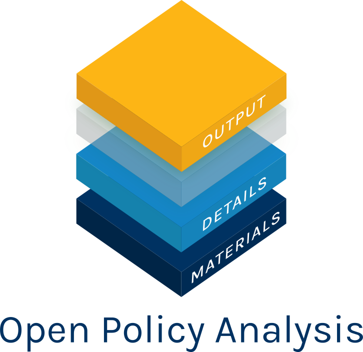
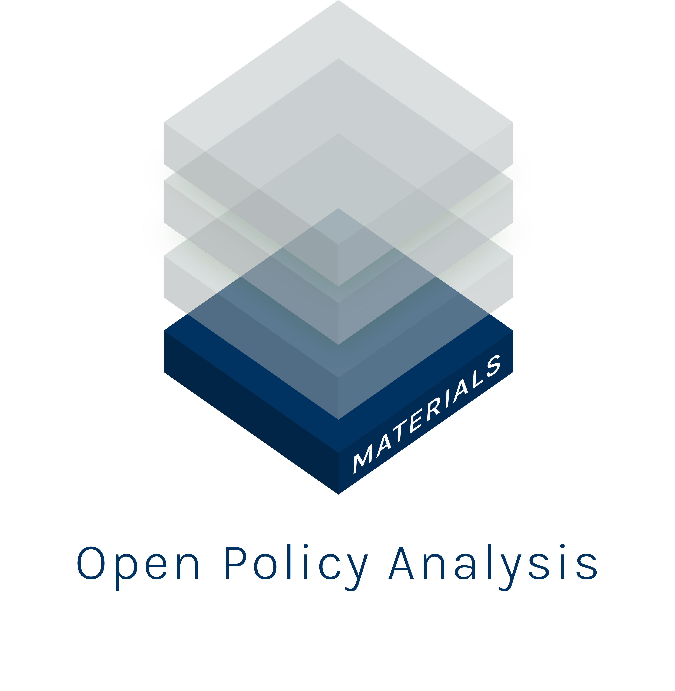

# Case Study on the Cost Effectiveness of Mass Deworming Interventions (Opposition Analysts Without All Assumptions Component)

## **This is a *fictitous* policy analsysis meant to demonstrate the value of the OPA framework**

 

Open in RStudio:

This repository and its accompanying dynamic document and Shiny app are
three key components of an Mothers Against Mass Deworming Analysis (MAMD) on the costs and
benefits of mass deworming interventions in various settings. Together,
these materials create a transparent and reproducible analysis to
facilitate collaboration and discussion about deworming policy.

1 - [An interactive plot](https://keanulim123.shinyapps.io/pa-dw-no-opaque-link-shiny-app/),
which summarizes the interactions between all key parameters for a given
set of assumptions. Materials can be found in:
[`code/shiny_app`](https://github.com/opposition-policy-analysis/pa-dw-no-opaque-link/tree/master/code/shiny_app).

2 - Open policy report in the form of a [dynamic
document](https://opposition-policy-analysis.github.io/pa-dw-no-opaque-link/), which details all
data, code, and assumptions included in the analysis. Materials can be
found in:
[`code/dynamic_doc`](https://github.com/opposition-policy-analysis/pa-dw-no-opaque-link/blob/master/code/01_final_opa.Rmd).

3 - This Github repository, which stores all data, code, and materials
necessary to replicate the analysis in full with minimal effort.
